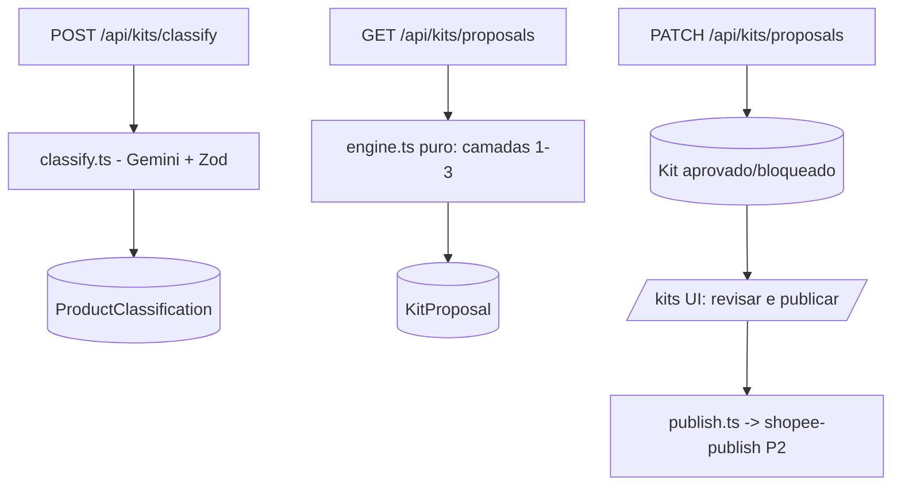

# Kit Generator Design

**Spec**: `.specs/features/kit-generator/spec.md`
**Status**: Approved

---

## Architecture Overview

Três camadas independentes: (1) classificação de catálogo via IA com revisão
manual, (2) engine pura de compatibilidade que gera propostas explicáveis,
(3) ciclo de vida de kit (proposta → aprovado → bloqueado → publicado) com
gate humano. Tabelas novas; `Produto` não é migrado — a classificação mora em
tabela própria 1:1 para permitir queries e retomada determinística.



## Code Reuse Analysis

### Existing Components to Leverage

| Component | Location | How to Use |
| --------- | -------- | ---------- |
| Endpoint Gemini + parsing JSON | `src/lib/publisher/ai-copy.ts` | Extrair cliente compartilhado (`lib/ai/gemini.ts`) e reusar |
| Chave BYOK por workspace | `WorkspaceAiConfig` + SecretStore | Resolver chave igual ao ai-copy |
| Estoque ao vivo | `ProductInventory` | Trava de estoque por SKU |
| Publicação Shopee | `src/lib/publisher/shopee-publish.ts` | Publicação de kits aprovados (P2) |
| Auth de rotas admin | padrão `getCurrentUserContext` + permissões | Gate das rotas `/api/kits/*` e página |

### Integration Points

| System | Integration Method |
| ------ | ------------------ |
| Database | Novas tabelas `ProductClassification`, `ComplementaryPair`, `KitProposal`, `Kit` |
| IA | Cliente Gemini compartilhado; fallback chave global `GEMINI_API_KEY` |

---

## Components

### gemini client (extraído)

- **Purpose**: chamada REST generateContent + strip de fences + parse JSON.
- **Location**: `src/lib/ai/gemini.ts`
- **Interfaces**: `generateJson<T>(input): Promise<{ data: T; raw }>`
- **Dependencies**: env `GEMINI_API_KEY` / WorkspaceAiConfig.
- **Reuses**: lógica hoje privada em `ai-copy.ts` (refactor mínimo).

### classify service

- **Purpose**: derivar `{gender, ageBand, categoryKey, colorPattern, confidence}` de título/categoria; marcar revisão quando confiança <0.7.
- **Location**: `src/lib/kits/classify.ts`
- **Interfaces**:
  - `classifyProduto(produto, config): Promise<ClassificationResult>`
  - `classifyBatch(workspaceId, limit=50): Promise<{processed, needsReview}>`
- **Dependencies**: gemini client, prisma.
- **Reuses**: schema Zod centraliza o contrato dos atributos.

### compatibility engine (puro)

- **Purpose**: camadas 1–3 do briefing: gênero+idade rígido, homogêneos/pares aprovados, estoque ≥min, preço ≤5×, preferência cor distinta, ordenação giro alto+lento.
- **Location**: `src/lib/kits/engine.ts`
- **Interfaces**:
  - `buildProposals(input: EngineInput): Proposal[]` (puro, sem IO)
- **Dependencies**: apenas tipos.
- **Reuses**: nenhum (novo domínio).

### proposals service

- **Purpose**: carregar classificados+estoque+pares, rodar engine, persistir propostas com hash anti-reproposta.
- **Location**: `src/lib/kits/proposals.ts`
- **Interfaces**: `generateProposals(clienteId): Promise<number>`
- **Dependencies**: engine, prisma.
- **Reuses**: fontes de estoque da regra low_stock.

### kits UI

- **Purpose**: revisão (aprovar/rejeitar), filtros por status/cliente, botão de publicação em lote (P2).
- **Location**: `src/app/(app)/kits/page.tsx` + `kits-client.tsx`
- **Dependencies**: rotas `/api/kits/*`.
- **Reuses**: padrões visuais das páginas existentes.

---

## Data Models

### ProductClassification

```typescript
interface ProductClassification {
  produtoId: string // unique FK Produto
  gender: "feminino" | "masculino" | "unissex"
  ageBand: "adulto" | "infantil"
  categoryKey: string // ex.: "vestido", "camiseta", "bermuda"
  colorPattern?: string | null
  confidence: number // 0..1
  source: "ai" | "manual" // manual nunca é sobrescrito
  reviewedAt?: Date | null
}
```

### ComplementaryPair

```typescript
interface ComplementaryPair {
  id: string
  categoryA: string
  categoryB: string
  active: boolean
}
```

### KitProposal / Kit

```typescript
interface KitProposal {
  id: string
  clienteId: string
  componentIds: string[] // 2..5 produtos
  reason: string // camada aplicada + giro
  comboHash: string // unique — impede reproposta idêntica após rejeição
  status: "proposta" | "aprovada" | "rejeitada"
}

interface Kit {
  id: string
  proposalId: string // unique FK KitProposal
  clienteId: string
  price: number // definido pelo usuário na aprovação
  status: "aprovado" | "bloqueado" | "publicado" | "erro"
  shopeeItemId?: string | null
}
```

**Relationships**: Classification 1:1 Produto; Proposal N:1 Cliente; Kit 1:1 Proposal.

---

## Error Handling Strategy

| Error Scenario | Handling | User Impact |
| -------------- | -------- | ----------- |
| IA falha / sem chave | Produto fica sem linha de classification; retry na próxima execução | Lote continua; contador mostra pendentes |
| Confiança <0.7 | Marca `needsReview`; sai dos cruzamentos | Item aparece em fila de revisão manual |
| Estoque cai abaixo do mínimo pós-aprovação | Revalidação marca kit `bloqueado` | Kit some das opções de publicação |
| Falha de publicação individual | Status `erro` + mensagem por kit; lote segue | Relatório parcial na UI |

---

## Risks & Concerns

| Concern | Location (file:line) | Impact | Mitigation |
| ------- | -------------------- | ------ | ---------- |
| Cliente Gemini duplicado entre features | `src/lib/publisher/ai-copy.ts:8` | Drift de prompt/modelo | Extração para `src/lib/ai/gemini.ts` no T2 com testes existentes verdes |
| `atributos Json` do Produto não indexável | `prisma/schema.prisma:614` | Queries de "não classificados" caras | Tabela dedicada 1:1 com índices relacionais |
| Custo de IA em 700+ itens | pipeline de classificação | Tempo/custo por passada | Lotes ≤50, cache por produto classificado, pulo de `source=manual/ai` |
| Sem testes de publicação real | publisher atual | P2 pode quebrar em produção | Publicação continua atrás de gate humano e rota testa com dry-run flag |

---

## Tech Decisions (only non-obvious ones)

| Decision | Choice | Rationale |
| -------- | ------ | --------- |
| Onde guardar atributos | Tabela própria, não o Json do Produto | Queryable, versionável e auditável |
| Motor de compatibilidade | Função pura sem IO | Teste exaustivo barato das camadas 1–3 |
| Anti-reproposta | Hash canônico dos componentIds em `comboHash` unique | Rejeição é definitiva sem consulta complexa |
| Gatilho de classificação | Rota admin batch (≤50) acionada da UI | Sem infra nova de cron no MVP |
